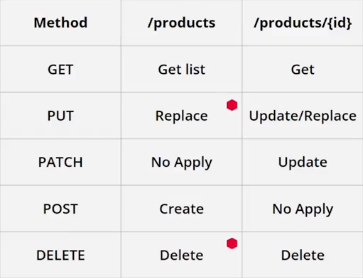

# my-store
Express course
Learning Express to build applications with Node.js.

# Express
Express is a minimal and flexible Node.js web application framework that provides a robust set of features for web and mobile applications.

## Installation

  npm install express --save

## Routing
Defining the differets routes/sections of the application.

## JSON
Using this format to send data to the client.

## API RESTful ( Representational State Transfer ) 
It's a convention that we use to comunicate services by HTTP protocols.

